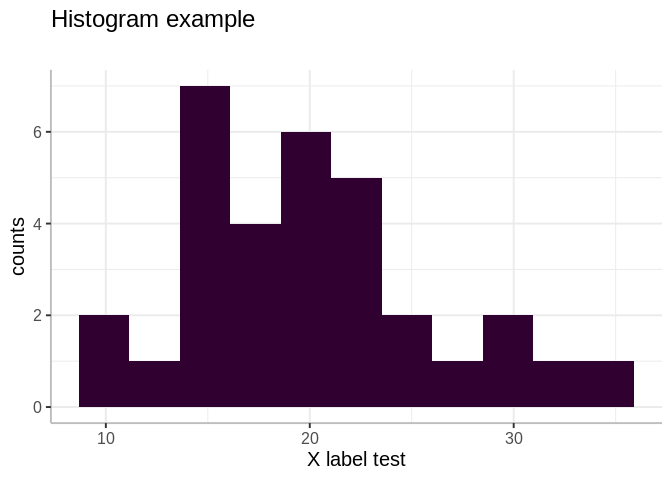
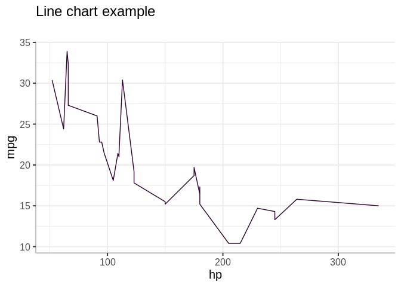
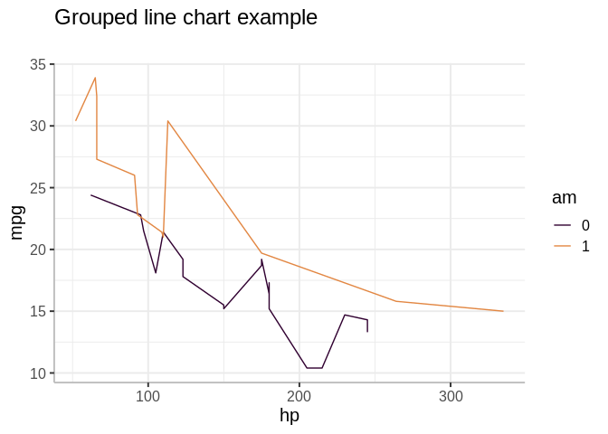
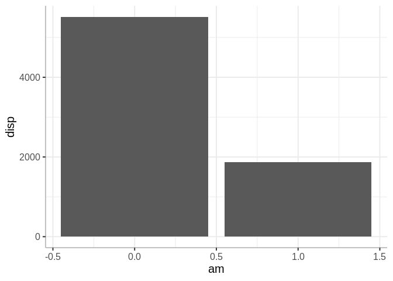
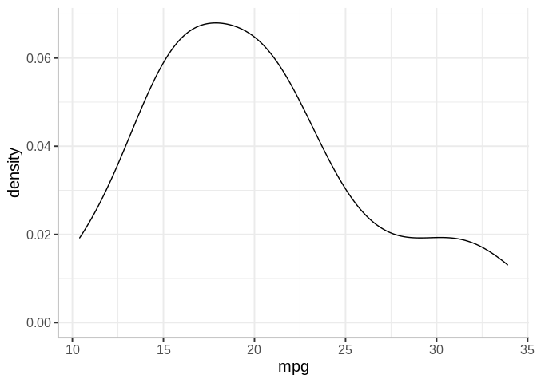
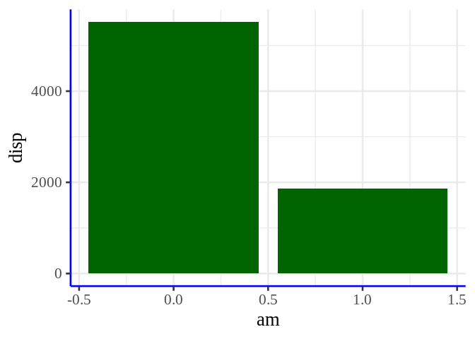

<!-- README.md is generated from README.Rmd. Please edit that file -->

# hence.plots

<!-- badges: start -->
<!-- badges: end -->

The goal of hence.plots is to provide easy to use table and plot
functions in the standards of Hence Analytics.

## Installation

You can install the development version of hence.plots from
[GitHub](https://github.com/) with:

``` r
# install.packages("devtools")
devtools::install_github("rodrigo-pifano/hence.plots")
```

## Example

This is a basic example which shows you how to solve a common problem:

``` r
library(hence.plots)
library(data.table)
library(magrittr)
library(plotly)
#> Loading required package: ggplot2
#> 
#> Attaching package: 'plotly'
#> The following object is masked from 'package:ggplot2':
#> 
#>     last_plot
#> The following object is masked from 'package:stats':
#> 
#>     filter
#> The following object is masked from 'package:graphics':
#> 
#>     layout
```

### 1) Table

``` r
mtcars %>%
  hence_table(p_row_names = TRUE)
```

<table class=" lightable-classic lightable-hover table" style="font-family: &quot;Arial Narrow&quot;, &quot;Source Sans Pro&quot;, sans-serif; margin-left: auto; margin-right: auto; font-size: 18px; margin-left: auto; margin-right: auto;">
<thead>
<tr>
<th style="text-align:left;">
</th>
<th style="text-align:center;">
mpg
</th>
<th style="text-align:center;">
cyl
</th>
<th style="text-align:center;">
disp
</th>
<th style="text-align:center;">
hp
</th>
<th style="text-align:center;">
drat
</th>
<th style="text-align:center;">
wt
</th>
<th style="text-align:center;">
qsec
</th>
<th style="text-align:center;">
vs
</th>
<th style="text-align:center;">
am
</th>
<th style="text-align:center;">
gear
</th>
<th style="text-align:center;">
carb
</th>
</tr>
</thead>
<tbody>
<tr>
<td style="text-align:left;">
Mazda RX4
</td>
<td style="text-align:center;">
21.0
</td>
<td style="text-align:center;">
6
</td>
<td style="text-align:center;">
160.0
</td>
<td style="text-align:center;">
110
</td>
<td style="text-align:center;">
3.90
</td>
<td style="text-align:center;">
2.620
</td>
<td style="text-align:center;">
16.46
</td>
<td style="text-align:center;">
0
</td>
<td style="text-align:center;">
1
</td>
<td style="text-align:center;">
4
</td>
<td style="text-align:center;">
4
</td>
</tr>
<tr>
<td style="text-align:left;">
Mazda RX4 Wag
</td>
<td style="text-align:center;">
21.0
</td>
<td style="text-align:center;">
6
</td>
<td style="text-align:center;">
160.0
</td>
<td style="text-align:center;">
110
</td>
<td style="text-align:center;">
3.90
</td>
<td style="text-align:center;">
2.875
</td>
<td style="text-align:center;">
17.02
</td>
<td style="text-align:center;">
0
</td>
<td style="text-align:center;">
1
</td>
<td style="text-align:center;">
4
</td>
<td style="text-align:center;">
4
</td>
</tr>
<tr>
<td style="text-align:left;">
Datsun 710
</td>
<td style="text-align:center;">
22.8
</td>
<td style="text-align:center;">
4
</td>
<td style="text-align:center;">
108.0
</td>
<td style="text-align:center;">
93
</td>
<td style="text-align:center;">
3.85
</td>
<td style="text-align:center;">
2.320
</td>
<td style="text-align:center;">
18.61
</td>
<td style="text-align:center;">
1
</td>
<td style="text-align:center;">
1
</td>
<td style="text-align:center;">
4
</td>
<td style="text-align:center;">
1
</td>
</tr>
<tr>
<td style="text-align:left;">
Hornet 4 Drive
</td>
<td style="text-align:center;">
21.4
</td>
<td style="text-align:center;">
6
</td>
<td style="text-align:center;">
258.0
</td>
<td style="text-align:center;">
110
</td>
<td style="text-align:center;">
3.08
</td>
<td style="text-align:center;">
3.215
</td>
<td style="text-align:center;">
19.44
</td>
<td style="text-align:center;">
1
</td>
<td style="text-align:center;">
0
</td>
<td style="text-align:center;">
3
</td>
<td style="text-align:center;">
1
</td>
</tr>
<tr>
<td style="text-align:left;">
Hornet Sportabout
</td>
<td style="text-align:center;">
18.7
</td>
<td style="text-align:center;">
8
</td>
<td style="text-align:center;">
360.0
</td>
<td style="text-align:center;">
175
</td>
<td style="text-align:center;">
3.15
</td>
<td style="text-align:center;">
3.440
</td>
<td style="text-align:center;">
17.02
</td>
<td style="text-align:center;">
0
</td>
<td style="text-align:center;">
0
</td>
<td style="text-align:center;">
3
</td>
<td style="text-align:center;">
2
</td>
</tr>
<tr>
<td style="text-align:left;">
Valiant
</td>
<td style="text-align:center;">
18.1
</td>
<td style="text-align:center;">
6
</td>
<td style="text-align:center;">
225.0
</td>
<td style="text-align:center;">
105
</td>
<td style="text-align:center;">
2.76
</td>
<td style="text-align:center;">
3.460
</td>
<td style="text-align:center;">
20.22
</td>
<td style="text-align:center;">
1
</td>
<td style="text-align:center;">
0
</td>
<td style="text-align:center;">
3
</td>
<td style="text-align:center;">
1
</td>
</tr>
<tr>
<td style="text-align:left;">
Duster 360
</td>
<td style="text-align:center;">
14.3
</td>
<td style="text-align:center;">
8
</td>
<td style="text-align:center;">
360.0
</td>
<td style="text-align:center;">
245
</td>
<td style="text-align:center;">
3.21
</td>
<td style="text-align:center;">
3.570
</td>
<td style="text-align:center;">
15.84
</td>
<td style="text-align:center;">
0
</td>
<td style="text-align:center;">
0
</td>
<td style="text-align:center;">
3
</td>
<td style="text-align:center;">
4
</td>
</tr>
<tr>
<td style="text-align:left;">
Merc 240D
</td>
<td style="text-align:center;">
24.4
</td>
<td style="text-align:center;">
4
</td>
<td style="text-align:center;">
146.7
</td>
<td style="text-align:center;">
62
</td>
<td style="text-align:center;">
3.69
</td>
<td style="text-align:center;">
3.190
</td>
<td style="text-align:center;">
20.00
</td>
<td style="text-align:center;">
1
</td>
<td style="text-align:center;">
0
</td>
<td style="text-align:center;">
4
</td>
<td style="text-align:center;">
2
</td>
</tr>
<tr>
<td style="text-align:left;">
Merc 230
</td>
<td style="text-align:center;">
22.8
</td>
<td style="text-align:center;">
4
</td>
<td style="text-align:center;">
140.8
</td>
<td style="text-align:center;">
95
</td>
<td style="text-align:center;">
3.92
</td>
<td style="text-align:center;">
3.150
</td>
<td style="text-align:center;">
22.90
</td>
<td style="text-align:center;">
1
</td>
<td style="text-align:center;">
0
</td>
<td style="text-align:center;">
4
</td>
<td style="text-align:center;">
2
</td>
</tr>
<tr>
<td style="text-align:left;">
Merc 280
</td>
<td style="text-align:center;">
19.2
</td>
<td style="text-align:center;">
6
</td>
<td style="text-align:center;">
167.6
</td>
<td style="text-align:center;">
123
</td>
<td style="text-align:center;">
3.92
</td>
<td style="text-align:center;">
3.440
</td>
<td style="text-align:center;">
18.30
</td>
<td style="text-align:center;">
1
</td>
<td style="text-align:center;">
0
</td>
<td style="text-align:center;">
4
</td>
<td style="text-align:center;">
4
</td>
</tr>
<tr>
<td style="text-align:left;">
Merc 280C
</td>
<td style="text-align:center;">
17.8
</td>
<td style="text-align:center;">
6
</td>
<td style="text-align:center;">
167.6
</td>
<td style="text-align:center;">
123
</td>
<td style="text-align:center;">
3.92
</td>
<td style="text-align:center;">
3.440
</td>
<td style="text-align:center;">
18.90
</td>
<td style="text-align:center;">
1
</td>
<td style="text-align:center;">
0
</td>
<td style="text-align:center;">
4
</td>
<td style="text-align:center;">
4
</td>
</tr>
<tr>
<td style="text-align:left;">
Merc 450SE
</td>
<td style="text-align:center;">
16.4
</td>
<td style="text-align:center;">
8
</td>
<td style="text-align:center;">
275.8
</td>
<td style="text-align:center;">
180
</td>
<td style="text-align:center;">
3.07
</td>
<td style="text-align:center;">
4.070
</td>
<td style="text-align:center;">
17.40
</td>
<td style="text-align:center;">
0
</td>
<td style="text-align:center;">
0
</td>
<td style="text-align:center;">
3
</td>
<td style="text-align:center;">
3
</td>
</tr>
<tr>
<td style="text-align:left;">
Merc 450SL
</td>
<td style="text-align:center;">
17.3
</td>
<td style="text-align:center;">
8
</td>
<td style="text-align:center;">
275.8
</td>
<td style="text-align:center;">
180
</td>
<td style="text-align:center;">
3.07
</td>
<td style="text-align:center;">
3.730
</td>
<td style="text-align:center;">
17.60
</td>
<td style="text-align:center;">
0
</td>
<td style="text-align:center;">
0
</td>
<td style="text-align:center;">
3
</td>
<td style="text-align:center;">
3
</td>
</tr>
<tr>
<td style="text-align:left;">
Merc 450SLC
</td>
<td style="text-align:center;">
15.2
</td>
<td style="text-align:center;">
8
</td>
<td style="text-align:center;">
275.8
</td>
<td style="text-align:center;">
180
</td>
<td style="text-align:center;">
3.07
</td>
<td style="text-align:center;">
3.780
</td>
<td style="text-align:center;">
18.00
</td>
<td style="text-align:center;">
0
</td>
<td style="text-align:center;">
0
</td>
<td style="text-align:center;">
3
</td>
<td style="text-align:center;">
3
</td>
</tr>
<tr>
<td style="text-align:left;">
Cadillac Fleetwood
</td>
<td style="text-align:center;">
10.4
</td>
<td style="text-align:center;">
8
</td>
<td style="text-align:center;">
472.0
</td>
<td style="text-align:center;">
205
</td>
<td style="text-align:center;">
2.93
</td>
<td style="text-align:center;">
5.250
</td>
<td style="text-align:center;">
17.98
</td>
<td style="text-align:center;">
0
</td>
<td style="text-align:center;">
0
</td>
<td style="text-align:center;">
3
</td>
<td style="text-align:center;">
4
</td>
</tr>
<tr>
<td style="text-align:left;">
Lincoln Continental
</td>
<td style="text-align:center;">
10.4
</td>
<td style="text-align:center;">
8
</td>
<td style="text-align:center;">
460.0
</td>
<td style="text-align:center;">
215
</td>
<td style="text-align:center;">
3.00
</td>
<td style="text-align:center;">
5.424
</td>
<td style="text-align:center;">
17.82
</td>
<td style="text-align:center;">
0
</td>
<td style="text-align:center;">
0
</td>
<td style="text-align:center;">
3
</td>
<td style="text-align:center;">
4
</td>
</tr>
<tr>
<td style="text-align:left;">
Chrysler Imperial
</td>
<td style="text-align:center;">
14.7
</td>
<td style="text-align:center;">
8
</td>
<td style="text-align:center;">
440.0
</td>
<td style="text-align:center;">
230
</td>
<td style="text-align:center;">
3.23
</td>
<td style="text-align:center;">
5.345
</td>
<td style="text-align:center;">
17.42
</td>
<td style="text-align:center;">
0
</td>
<td style="text-align:center;">
0
</td>
<td style="text-align:center;">
3
</td>
<td style="text-align:center;">
4
</td>
</tr>
<tr>
<td style="text-align:left;">
Fiat 128
</td>
<td style="text-align:center;">
32.4
</td>
<td style="text-align:center;">
4
</td>
<td style="text-align:center;">
78.7
</td>
<td style="text-align:center;">
66
</td>
<td style="text-align:center;">
4.08
</td>
<td style="text-align:center;">
2.200
</td>
<td style="text-align:center;">
19.47
</td>
<td style="text-align:center;">
1
</td>
<td style="text-align:center;">
1
</td>
<td style="text-align:center;">
4
</td>
<td style="text-align:center;">
1
</td>
</tr>
<tr>
<td style="text-align:left;">
Honda Civic
</td>
<td style="text-align:center;">
30.4
</td>
<td style="text-align:center;">
4
</td>
<td style="text-align:center;">
75.7
</td>
<td style="text-align:center;">
52
</td>
<td style="text-align:center;">
4.93
</td>
<td style="text-align:center;">
1.615
</td>
<td style="text-align:center;">
18.52
</td>
<td style="text-align:center;">
1
</td>
<td style="text-align:center;">
1
</td>
<td style="text-align:center;">
4
</td>
<td style="text-align:center;">
2
</td>
</tr>
<tr>
<td style="text-align:left;">
Toyota Corolla
</td>
<td style="text-align:center;">
33.9
</td>
<td style="text-align:center;">
4
</td>
<td style="text-align:center;">
71.1
</td>
<td style="text-align:center;">
65
</td>
<td style="text-align:center;">
4.22
</td>
<td style="text-align:center;">
1.835
</td>
<td style="text-align:center;">
19.90
</td>
<td style="text-align:center;">
1
</td>
<td style="text-align:center;">
1
</td>
<td style="text-align:center;">
4
</td>
<td style="text-align:center;">
1
</td>
</tr>
<tr>
<td style="text-align:left;">
Toyota Corona
</td>
<td style="text-align:center;">
21.5
</td>
<td style="text-align:center;">
4
</td>
<td style="text-align:center;">
120.1
</td>
<td style="text-align:center;">
97
</td>
<td style="text-align:center;">
3.70
</td>
<td style="text-align:center;">
2.465
</td>
<td style="text-align:center;">
20.01
</td>
<td style="text-align:center;">
1
</td>
<td style="text-align:center;">
0
</td>
<td style="text-align:center;">
3
</td>
<td style="text-align:center;">
1
</td>
</tr>
<tr>
<td style="text-align:left;">
Dodge Challenger
</td>
<td style="text-align:center;">
15.5
</td>
<td style="text-align:center;">
8
</td>
<td style="text-align:center;">
318.0
</td>
<td style="text-align:center;">
150
</td>
<td style="text-align:center;">
2.76
</td>
<td style="text-align:center;">
3.520
</td>
<td style="text-align:center;">
16.87
</td>
<td style="text-align:center;">
0
</td>
<td style="text-align:center;">
0
</td>
<td style="text-align:center;">
3
</td>
<td style="text-align:center;">
2
</td>
</tr>
<tr>
<td style="text-align:left;">
AMC Javelin
</td>
<td style="text-align:center;">
15.2
</td>
<td style="text-align:center;">
8
</td>
<td style="text-align:center;">
304.0
</td>
<td style="text-align:center;">
150
</td>
<td style="text-align:center;">
3.15
</td>
<td style="text-align:center;">
3.435
</td>
<td style="text-align:center;">
17.30
</td>
<td style="text-align:center;">
0
</td>
<td style="text-align:center;">
0
</td>
<td style="text-align:center;">
3
</td>
<td style="text-align:center;">
2
</td>
</tr>
<tr>
<td style="text-align:left;">
Camaro Z28
</td>
<td style="text-align:center;">
13.3
</td>
<td style="text-align:center;">
8
</td>
<td style="text-align:center;">
350.0
</td>
<td style="text-align:center;">
245
</td>
<td style="text-align:center;">
3.73
</td>
<td style="text-align:center;">
3.840
</td>
<td style="text-align:center;">
15.41
</td>
<td style="text-align:center;">
0
</td>
<td style="text-align:center;">
0
</td>
<td style="text-align:center;">
3
</td>
<td style="text-align:center;">
4
</td>
</tr>
<tr>
<td style="text-align:left;">
Pontiac Firebird
</td>
<td style="text-align:center;">
19.2
</td>
<td style="text-align:center;">
8
</td>
<td style="text-align:center;">
400.0
</td>
<td style="text-align:center;">
175
</td>
<td style="text-align:center;">
3.08
</td>
<td style="text-align:center;">
3.845
</td>
<td style="text-align:center;">
17.05
</td>
<td style="text-align:center;">
0
</td>
<td style="text-align:center;">
0
</td>
<td style="text-align:center;">
3
</td>
<td style="text-align:center;">
2
</td>
</tr>
<tr>
<td style="text-align:left;">
Fiat X1-9
</td>
<td style="text-align:center;">
27.3
</td>
<td style="text-align:center;">
4
</td>
<td style="text-align:center;">
79.0
</td>
<td style="text-align:center;">
66
</td>
<td style="text-align:center;">
4.08
</td>
<td style="text-align:center;">
1.935
</td>
<td style="text-align:center;">
18.90
</td>
<td style="text-align:center;">
1
</td>
<td style="text-align:center;">
1
</td>
<td style="text-align:center;">
4
</td>
<td style="text-align:center;">
1
</td>
</tr>
<tr>
<td style="text-align:left;">
Porsche 914-2
</td>
<td style="text-align:center;">
26.0
</td>
<td style="text-align:center;">
4
</td>
<td style="text-align:center;">
120.3
</td>
<td style="text-align:center;">
91
</td>
<td style="text-align:center;">
4.43
</td>
<td style="text-align:center;">
2.140
</td>
<td style="text-align:center;">
16.70
</td>
<td style="text-align:center;">
0
</td>
<td style="text-align:center;">
1
</td>
<td style="text-align:center;">
5
</td>
<td style="text-align:center;">
2
</td>
</tr>
<tr>
<td style="text-align:left;">
Lotus Europa
</td>
<td style="text-align:center;">
30.4
</td>
<td style="text-align:center;">
4
</td>
<td style="text-align:center;">
95.1
</td>
<td style="text-align:center;">
113
</td>
<td style="text-align:center;">
3.77
</td>
<td style="text-align:center;">
1.513
</td>
<td style="text-align:center;">
16.90
</td>
<td style="text-align:center;">
1
</td>
<td style="text-align:center;">
1
</td>
<td style="text-align:center;">
5
</td>
<td style="text-align:center;">
2
</td>
</tr>
<tr>
<td style="text-align:left;">
Ford Pantera L
</td>
<td style="text-align:center;">
15.8
</td>
<td style="text-align:center;">
8
</td>
<td style="text-align:center;">
351.0
</td>
<td style="text-align:center;">
264
</td>
<td style="text-align:center;">
4.22
</td>
<td style="text-align:center;">
3.170
</td>
<td style="text-align:center;">
14.50
</td>
<td style="text-align:center;">
0
</td>
<td style="text-align:center;">
1
</td>
<td style="text-align:center;">
5
</td>
<td style="text-align:center;">
4
</td>
</tr>
<tr>
<td style="text-align:left;">
Ferrari Dino
</td>
<td style="text-align:center;">
19.7
</td>
<td style="text-align:center;">
6
</td>
<td style="text-align:center;">
145.0
</td>
<td style="text-align:center;">
175
</td>
<td style="text-align:center;">
3.62
</td>
<td style="text-align:center;">
2.770
</td>
<td style="text-align:center;">
15.50
</td>
<td style="text-align:center;">
0
</td>
<td style="text-align:center;">
1
</td>
<td style="text-align:center;">
5
</td>
<td style="text-align:center;">
6
</td>
</tr>
<tr>
<td style="text-align:left;">
Maserati Bora
</td>
<td style="text-align:center;">
15.0
</td>
<td style="text-align:center;">
8
</td>
<td style="text-align:center;">
301.0
</td>
<td style="text-align:center;">
335
</td>
<td style="text-align:center;">
3.54
</td>
<td style="text-align:center;">
3.570
</td>
<td style="text-align:center;">
14.60
</td>
<td style="text-align:center;">
0
</td>
<td style="text-align:center;">
1
</td>
<td style="text-align:center;">
5
</td>
<td style="text-align:center;">
8
</td>
</tr>
<tr>
<td style="text-align:left;">
Volvo 142E
</td>
<td style="text-align:center;">
21.4
</td>
<td style="text-align:center;">
4
</td>
<td style="text-align:center;">
121.0
</td>
<td style="text-align:center;">
109
</td>
<td style="text-align:center;">
4.11
</td>
<td style="text-align:center;">
2.780
</td>
<td style="text-align:center;">
18.60
</td>
<td style="text-align:center;">
1
</td>
<td style="text-align:center;">
1
</td>
<td style="text-align:center;">
4
</td>
<td style="text-align:center;">
2
</td>
</tr>
</tbody>
</table>

<br><br/>

### 2) Histogram

``` r
hence_histogram(mtcars$mpg,
                p_title = "Histogram example",
                p_xlab = "X label test",
                p_ylab = "counts") 
```



<br><br/>

### 3) Line Charts

#### Single

``` r
hence_line_chart(p_dados = mtcars,
                 p_x = hp,
                 p_y = mpg,
                 p_title = "Line chart example") 
```



<br><br/>

#### Grouped

``` r
hence_line_chart(p_dados = mtcars %>% mutate(am = as.factor(am)),
                 p_x = hp,p_y = mpg,
                 p_color = am,
                 p_title = "Grouped line chart example") 
```



<br><br/>

### 4) Other types

Bar plot

``` r
mtcars %>%
  ggplot(aes(x = am,y = disp)) +
  geom_bar(stat = "identity") +
  theme_hence()
```



<br><br/>

Density plot

``` r
mtcars %>%
  ggplot(aes(x = mpg)) +
  geom_density() +
  theme_hence()
```



<br><br/>

There is also the possibility of customizing certain parameters of
theme_hence():

``` r
mtcars %>%
  ggplot(aes(x = am,y = disp)) +
  geom_bar(stat = "identity", fill = "dark green") +
  theme_hence(p_base_size = 20,
              p_pase_family = "Times New Roman",
              p_line_colour = "blue")
```



<br><br/>
